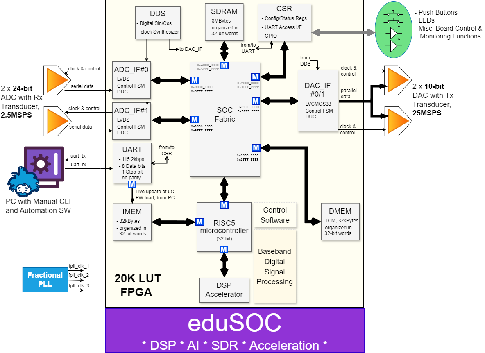

# eduSOC
Flexible, hardware-accelerated RISC-V based SOC
## System Overview
This is a RISC-V based bare-metal C running SOC intended for DSP applications where FPGA hardware freedom might come in handy. Currently deploying a single DSP accelerator, FPGA fabric is still left largely untouched, waiting it's call for AI inference, or be it any other kind of acceleration. At the heart of the SOC lies [eduBOS5](https://github.com/tarik-ibrahimovic/eduBOS5), our own custom RISC-V core, with **eduBUS**, a single-cycle synchronous bus tying it all together. Another feature is that the CPU is fully interchangeable with [picoRV32](https://github.com/YosysHQ/picorv32) adding another layer of customization to the design.

## Software
Tightly coupled software and hardware lead to superb performance, and crafting both ensures we maintain total control. Nothing beats the sheer speed of Bare-metal C, which is the current way to go, taking advantage of the tailored hardware. Come time there emerges a need for an easier task or resource management, FreeRTOS is warmed up and ready to step in. FreeRTOS also enhances software portability, expanding possibilities for improved comparison.
## Verification
Static (formal) methods are employed initially to verify clock domain crossings, logic equivalence, and assorted properties. The emphasis on speed within eduSOC extends to the verification phase of the project, employing Verilator for functional verification. Although it's not yet UVM, Verilator's C++ testbench is somewhat masked away with a SystemVerilog one.

An upcoming feature involves integrating a CPU/System emulator, facilitating embedded software developers in running and debugging software on a simulated model of given hardware, bypassing the complexities of full hardware functional simulation. Additionally, it can be utilized to conduct more comprehensive and in-depth verification.
## Build